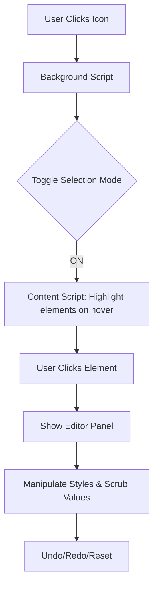

# Dragger Style Editor: Extension Overview

Dragger is a lightweight, real-time Google Chrome extension designed for developers and designers to inspect and modify web element styles directly in the browser with a premium, interactive interface.

## Architecture

The extension follows a standard Manifest V3 architecture:

- **Manifest (`manifest.json`)**: Configures permissions (`activeTab`, `scripting`) and entry points.
- **Background Script (`background.js`)**: A service worker that listens for the extension icon click to toggle the selection mode.
- **Content Script (`content.js`)**: The core engine that handles element selection, UI injection, style manipulation, and state management.
- **Styles (`content.css`)**: Provides a modern, "Inter"-based UI with smooth transitions and a clean layout.

---

## Key Features

### 1. Element Selection Mode
- **Toggleable**: Activated via the extension icon.
- **Visual Feedback**: Elements are highlighted with a blue outline on hover.
- **Isolation**: Prevents default click actions during selection.

### 2. Interactive Editor Panel
- **Draggable**: The panel can be moved anywhere on the screen by dragging the header.
- **Tabbed Interface**: Organized into logical sections:
    - **Layout**: Width, Height, and Display.
    - **Typography**: Color (with alpha), Font Size, and Font Weight.
        - **Smart Font Detection**: Displays the *actual* rendered font at the top of the list (bypassing the fallback stack) for accurate inspection.
    - **Background**: Fill Color with opacity control.
    - **Borders**: Width, Style, Color, and individual Corner Radius controls.
    - **Spacing**: A "Virtual Box" for intuitive Margin and Padding adjustments.
    - **Transform**: 3D Translation (X, Y, Z), Scale, and Rotation with presets.

### 3. Advanced Controls
- **Scrubbable Inputs**: Click and drag horizontally on numeric inputs (or the Spacing Box labels) to increment/decrement values instantly.
- **History Management**: Full Undo/Redo stack (up to 20 steps) to experiment without risk.
- **Reset**: Quickly revert an element to its original state.
- **Color Picker**: Integrated hex value input and alpha slider.

---

## Technical Details

### Style Persistence
Dragger uses an ephemeral history stack for the current session. Original styles are captured the first time an element is selected to ensure accurate resets.

### Logic Flow

### UI Aesthetics
- **Typography**: Uses Google Fonts (Inter).
- **Glassmorphism**: Subtle shadows and borders for a premium feel.
- **Responsive Controls**: Grid-based layout for input fields.
